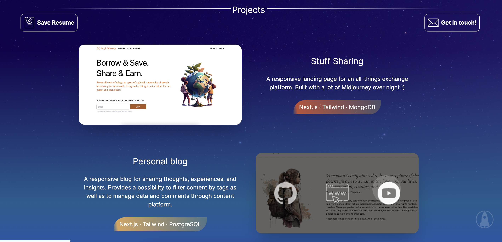
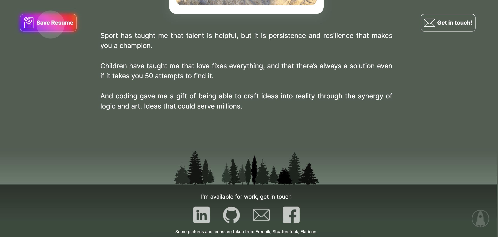

# Portfolio

Live: https://portfolio-2023-cdon.vercel.app

## Table of contents

- [Overview](#overview)
  - [The challenge](#the-challenge)
  - [Screenshots](#screenshot)
- [My process](#my-process)
  - [Built with](#built-with)
  - [What I learned](#what-i-learned)
  - [Continued development](#continued-development)
- [Author](#author)
- [Acknowledgments](#acknowledgments)

## Overview

### The challenge

Users should be able to:

- View the optimal layout depending on their device's screen size
- Navigate through content easily and intuitively
- Be able to download CV (through nav bar button)
- Be able to send an email (through nav bar button)
- Be able to view projects and navigate to source code, live version and a video.
- Some may find a hidden message when clicking on skills icons.
- Be able to view photo carousel
- Be able to navigate to social medias and other links in footer
- Hire me :)

### Screenshots

Home

Projects with links to live website, source code and youtube video showing up on hover

Footer with links and highlighted link to CV in the navbar

## My process
I went over dozens of other developers' portfolios for reference. Noticed that many of them while looking impressive in turms of css animations were overwhelming for someone who's seeing the website for the first time. I wanted to combine both - make my portfolio creative with little animation and tricks here and there, while still keeping the user's focus on the main agenda of a portfolio.
I also didn't want to spend too much time on this project in terms of designing, so tried to utilize as many ready-to-go solutions as possible. I'm very happy with how it turned out. A lot of elements like buttons, sliders, carousel, scroll-to-top button, background pictures, pop-up messages etc were taken from free sources and adapted to the common design.
I'm also happy how it got the "cosmos" vibe, although it wasn't planned, just happened along the way. All in all I really enjoyed the journey and the outcome. I like the place where creativity meets logic.

### Built with

- Next.JS
- Tailwind CSS
- Lots of libraries

### What I learned

- Not building everything fro scratch, but utilizing as many ready-to-go solutions as possible
- Definitely lifted my css skills

### Continued development

In the future I would like to add features as:

- More meaningful projects to show off :)

## Author

Anya Joy - @AnyaJoy

## Acknowledgments

Kudos to all the people sharing free solutions online, you are my heroes!
